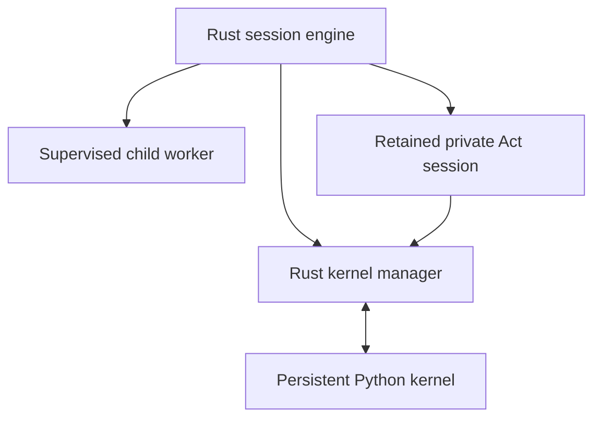

# Recursive runtime

Rust owns provider execution, durable session history, child admission, accounting, and cancellation. The persistent Python kernel supplies the model-facing API. Python host requests and Rust replies use correlated JSON messages; an ordinary host request has one terminal reply. Act additionally exchanges shared-cell requests and results over the same live channel.



The kernel is provisioned lazily. Its namespace survives ordinary cells, and persisted sessions can snapshot it for revival. Protocol version 4 supports correlated duplex host requests. Runtime shutdown closes pending exchanges and awaits owned cleanup before replacement.

## Independent children

```python
handle = await rlm.spawn("Review the API", name="api-reviewer", model="@task")
print(handle.rlm_child_id, handle.name, handle.session_dir, handle.model)
```

The handle confirms admission. Children report results through explicit `agent_message` replies or files. Daemon-backed children run in independently supervised workers with their own transcript, kernel, and artifact directory. Named role candidates are resolved in order against available credentials and the model allowlist. Exact model selections remain single-model selections.

```python
await agent_message.send("Check the regression", receiver_role="child", receiver_name=handle.name)
children = await rlm.list_subagents()
await rlm.delete_subagent(children[0])
```

Names are reserved before asynchronous admission and released on cancellation or failure. Retained children remain addressable after their initial task settles. Deletion removes family addressing and leaves a collectable cancellation receipt. Closing a parent closes its descendants with the parent's lifecycle reason.

The default recursion limit is two. Children inherit the parent's configured bound and launch restrictions. `--rlm-max-depth-ceiling N` caps the effective bound, including later changes; zero disables recursive admission. `--disable-rlm-act` disables Act. Restrictions survive runtime replacement without changing saved settings.

## Shared-world Act

```python
result = await rlm.act("Inspect the parser and return decisive evidence", model="@task")
```

Act suspends its directing Python call while a private model session uses `shared_ipython` in the same root namespace. The actor finishes by executing `rlm.done(value)`. The identical Python object returns to its caller; its value never crosses the Rust bridge. An ordinary text answer without `done` fails the assignment.

Each admitted depth and resolved model has a retained private transcript. Reusing that model reuses its context; another model gets a separate context. Private sessions have no family identity, independent kernel, child publication, goals, or autonomous continuation. Depth starts at zero for the root. `rlmActMaxDepth` defaults to one; zero disables Act. `rlmActDefaultModel` accepts a depth-one selector or an array indexed by positive depth.

Root prompts, cells, and compaction share a cancellable foreground lease. Nested Act calls retain that lease until the outer chain finishes. Ordinary child workers remain independent. Root steering stays outside private Act context. POSIX cancellation supports correlated synchronous-cell interruption and managed process groups; native Windows exposes cooperative cancellation. Completed effects are preserved.

The root journal writes an `act_start` before provider or cell admission and a correlated `act_terminal` after completion, cancellation, or failure. Records include depth, model, usage baseline or delta, and bounded diagnostics. Interrupted starts recover once from their private transcript without calling a provider or replaying a cell.

Act usage contributes to root totals while keeping the root's own model context measurement separate. Context trees show retained Act depths with their own usage and nested relationships. Live projections include assignment identity, outer tool-call identity, depth, optional parent assignment, and sequence. Projections contain no returned value or private transcript. Supported daemon clients negotiate `act_projection`; RPC, JSON, and ACP preserve the same ordering and depth facts.

## External completion events

```python
job = bash("long command")
job_id = external_event.watch_bash(job, "build")
# For a completion source managed separately:
await external_event.emit("build", event_id="completed", text="The build passed")
```

The registry coalesces repeated watch/event identities after successful admission. Failed or cancelled admissions can retry. Completion messages have system-sibling provenance and enter normal steering or start an idle turn. Watches and pending completion messages hold goal and autonomous continuation until delivery settles. Local print mode waits for watched work and admitted completion turns before disposal.

Retained watches and unfinished admissions are bounded. Disposal stops admission and removes owned queued completions. Interactive watch panels are read-only and use a configurable keybinding, `Alt+W` by default. Optional daemon watch projections require the `external_event_watches` capability.

## Goals and harness restrictions

Goals are created only on explicit request. `goal.pause(reason)` records an external dependency and withdraws queued goal continuation; `goal.resume()` reactivates a paused goal. Completion requires achieved work and reports the existing budget accounting. Host handlers dispatch their registered operation rather than a caller-supplied operation name.

`--mode rpc --harness-mode rpc-only` disables recursive admission, Act, goals, heartbeats, messaging, external events, refinement, and autonomous continuation for that launch. Read-only observation, model information, and explicit compaction remain available. Daemon launch restrictions and ordered child model candidates require negotiated `runtime_launch_policy` support, so older daemons cannot silently ignore them.

## Implementation locations

| Component | Location |
|---|---|
| Kernel process and host channels | `crates/pa-core/src/kernel/` |
| Child host requests and validation | `crates/pa-core/src/session_engine/rlm_host.rs` |
| Supervised child lifecycle | `crates/pa-daemon/src/rlm_children/` |
| Private Act execution and projection | `crates/pa-core/src/session_engine/act_runtime/` |
| Foreground admission | `crates/pa-core/src/session_engine/root_foreground_lease.rs` |
| Local completion admission | `crates/pa-core/src/session_engine/local_external_events.rs` |
| Python runtime and shared namespace | `prime-agent-runtime/src/rlm/` |

The Python kernel runs with the worker's operating-system permissions. Provider credentials remain in Rust; model discovery exposes bounded metadata to Python.
