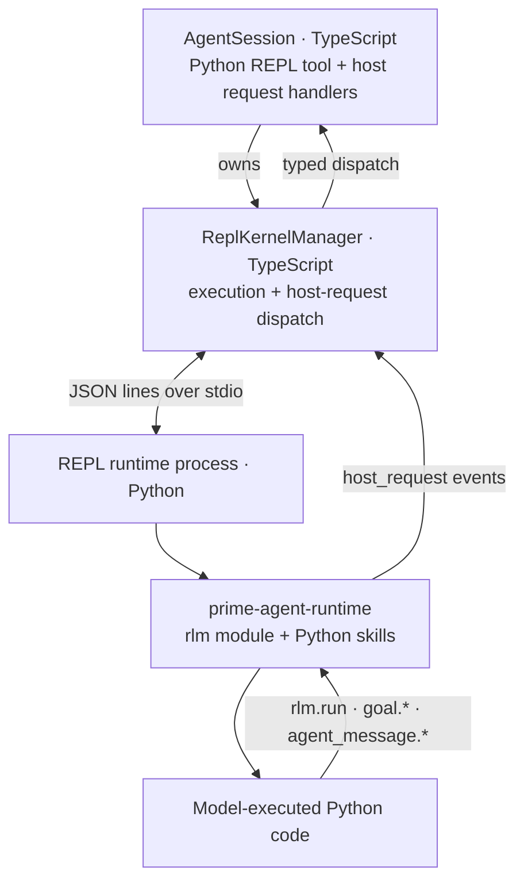
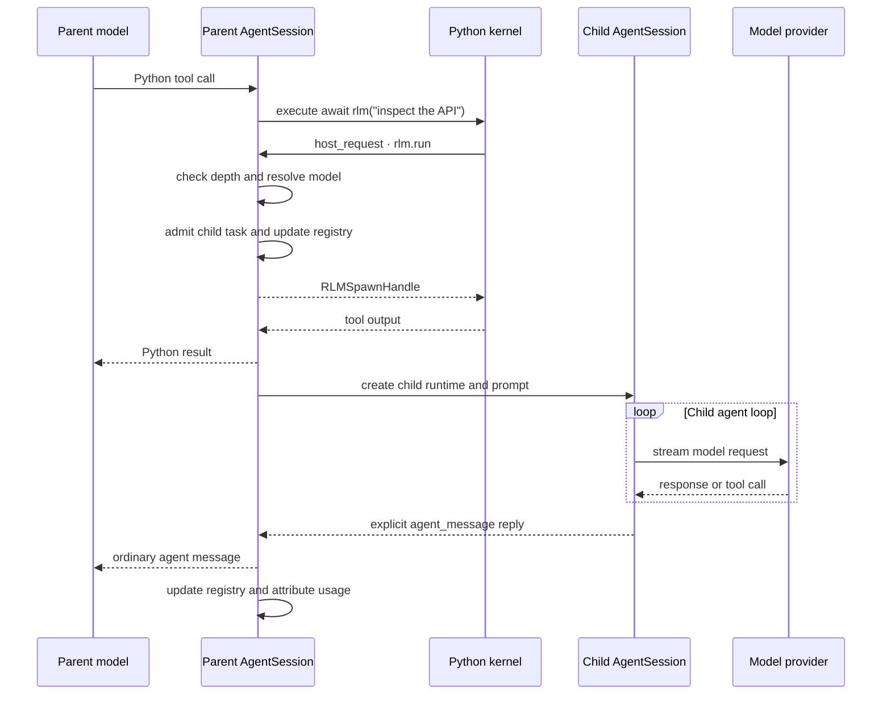
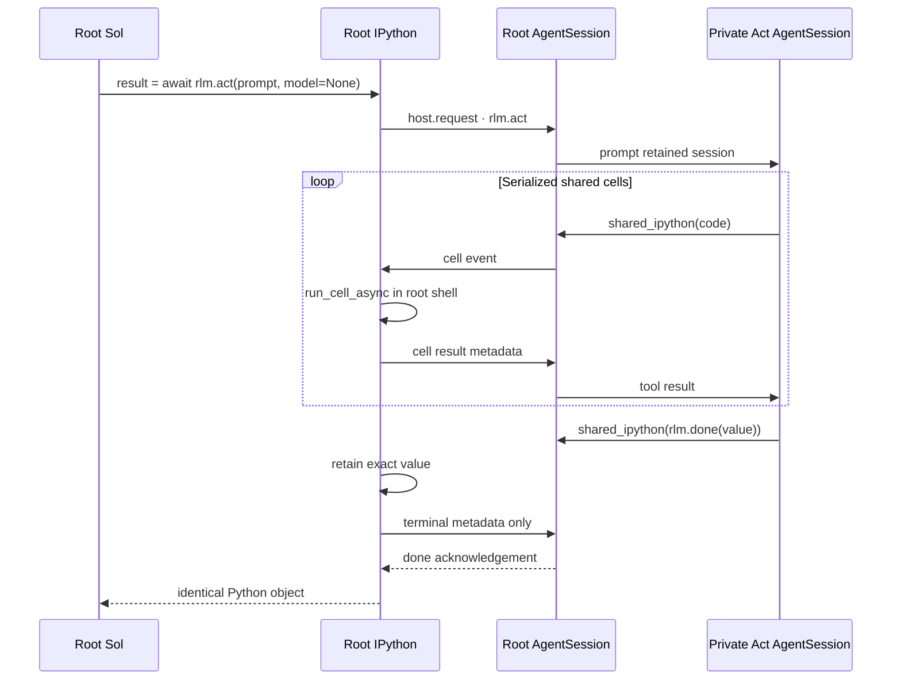

# RLM Runtime Architecture

Prime Agent gives each agent session a persistent Python REPL kernel and a native recursive sub-agent interface. The Python `rlm` package is a model-facing shim; the TypeScript host owns child execution, persistence, usage accounting, and lifecycle.

## Architecture



When the model delegates work:

```python
handle = await rlm("inspect the API", name="api-reviewer", service_tier="default")
print(handle.rlm_child_id, handle.name, handle.session_dir, handle.model)
```

the call travels as a `host_request` event over the runtime's stdio protocol. `ReplKernelManager` dispatches request type `rlm.run` to the parent `AgentSession`, which starts a child through the same TypeScript agent machinery as the parent. The call returns over the same bridge immediately after task admission with a child handle; it never waits for or returns the child's answer. Results arrive only through explicit `agent_message` replies or files.

The same bridge supports other typed host requests. Bundled Python skills such as `goal` call `rlm.host_request("goal.get", ...)`; state and policy remain in the TypeScript host.

## Delegation Flow



## Act Flow

`await rlm.act(prompt, model=None)` keeps the root `execute_request` suspended while one private retained Act `AgentSession` runs. The request keeps one Jupyter comm open in both directions:



`KernelManager` preserves the existing one-request/one-reply behavior for ordinary host calls. The Act handler additionally uses the request's `HostRequestChannel` to send non-terminal cell events and receive their replies before the final status. Comm closure aborts the channel and the private model turn.

Act depth starts at 0 for Sol. `rlmActMaxDepth` defaults to 1. A scalar default selector applies only at depth 1; an array supplies selectors by depth, and an explicit selector overrides that depth's entry. Missing, over-depth, invalid, unavailable, and non-native admissions fail before provider or cell work. Each admitted depth retains a separate private transcript per resolved model. Repeating a selector that resolves to the same model resumes that transcript; resolving another model opens another retained session instead of appending a model change to the previous actor's context. Every lane still uses only `shared_ipython` in the one root kernel. The private sessions receive no kernel provisioner, goals, heartbeat, autonomous continuation, family controllers, child registry entry, or daemon publication. The first model at depth 1 persists at `session-artifacts/<root-session-id>/act/session.jsonl`; the first model at depth N uses `act-depth-N/session.jsonl`. Additional resolved models use stable `-model-<hash>` sibling directories. A private `model-key` marker binds each directory without entering model context.

The root journal appends an `act_start` entry with explicit `depth`, optional `parentActId`, and that depth lane's cumulative usage baseline before provider or cell work, then a correlated `act_terminal` for `done`, `cancelled`, or `error`. Terminal entries contain the selected model's usage delta, concrete model, and bounded error text; they never contain the returned Python value or executable task state. On reconstruction, each current-branch start without a terminal becomes one `interrupted` terminal from its own depth transcript. Historical entries without `depth` normalize to 1. Recovery never calls a provider, resumes a request, or replays a cell.

Act usage is additive to the root total but is not folded into Sol's assistant message. `/context` therefore reports Sol own usage and context-window use unchanged, reports one nested `act` / `act-depth-N` node per retained depth, reconciles each node from that depth's terminals, and keeps the aggregate root total equal to Sol plus every Act depth plus ordinary attributed children.

## Component Ownership

| Component | Responsibility |
|---|---|
| `src/core/kernel/repl-manager.ts` | Runtime process, stdio protocol, execution, host-request dispatch, interrupt, and shutdown. |
| `src/core/tools/ipython.ts` | Agent tool wrapper, lazy kernel provisioning, namespace bootstrap, and output shaping. |
| `src/core/agent-session.ts` | RLM policy, child creation, private Act session creation, registry, usage attribution, cancellation, and goal handlers. |
| `src/core/act-lane.ts` | One retained private model session at one Act depth, serialized shared-cell exchange, terminal completion, and one-active-per-depth enforcement. |
| `src/core/rlm-runtime.ts` | Typed request/spawn-handle validation for `rlm.run`, model discovery, list, and delete. |
| `prime-agent-runtime/src/rlm/` | Python shim, handle types, callable `rlm`, and session-backed harness state. |

The Python side does not call providers or implement an agent loop.

## Kernel Lifecycle

The kernel is created lazily on first Python REPL use. Python resolution is:

1. `PRIME_AGENT_KERNEL_PYTHON`, when it has a current `prime-agent-runtime`;
2. `~/.prime/agent/kernel-venv/bin/python`, bootstrapped with `uv`; or
3. the XDG data location when `~/.prime` is not writable.

The managed environment includes Python 3.11, `prime-agent-runtime`, `dill`, and the default Python packages. A bootstrap marker detects stale environments.

Startup spawns `python -m rlm.repl` and exchanges newline-delimited JSON over stdio: the runtime announces itself with a single `ready` event, then requests and events flow one JSON object per line (see `prime-agent-runtime/src/rlm/repl.md`).

The manager owns the child process and a bounded stderr tail. Shutdown sends a `shutdown` request, waits for the process to exit, and terminates it as a fallback. Persistent sessions may snapshot the kernel namespace into their session artifact directory for revival.

## Stdio Transport

Requests flow to the runtime on stdin and events return on stdout, one JSON object per line:

```text
requests  execute, interrupt, host_reply, snapshot, restore, list_names, shutdown
events    ready, stdout, stderr, result, display, host_request, error, done
```

Output events carry the id of the cell that was running when the bytes were produced; asyncio tasks keep their spawning cell's id even after that cell finishes, so detached work is attributed correctly.

Calls to `ReplKernelManager.execute()` are serialized. One kernel has one shared namespace and does not run two ordinary Python cells concurrently. RLM child agents can still run concurrently because each delegation uses a distinct host request and child runtime.

## Host-Request Event Flow

A running cell can await task admission:

```python
handle = await rlm("subtask")
```

The runtime ships the call to the host as a `host_request` event and keeps its event loop free while awaiting the reply. The host dispatches the typed request and answers with a `host_reply` request carrying the same id, so a cell can block on admission without stalling other runtime work. Child answers do not use this response path; they arrive later through explicit `agent_message` replies or files.

## Python API

`prime-agent-runtime` exports:

```python
rlm
act(prompt: str, model: str | None = None)
done(value)
ActError
ActCancelledError
ActSteeredError
run(prompt: str, **kwargs)
find_models(query: str = "", limit: int = 8)
list_subagents()
delete_subagent(selector)
host_request(request_type: str, payload: dict | None = None)
RLMSpawnHandle
RLMModel
RLMSubagent
```

The kernel bootstrap places the callable `rlm` object in the user namespace, so these are equivalent:

```python
await rlm("subtask")
await rlm.run("subtask")
```

The root-only foreground API is:

```python
result = await rlm.act("bounded serial task", model=None)
# The active model terminates from a shared cell with rlm.done(value).
```

One root foreground lease spans the directing model turn and its nested IPython executions. A correlated Act remains the active foreground actor until the outer kernel execution reports idle. Root prompts, root cells, compaction, and automatic or goal continuations enter one deterministic admission path and begin once after the prior actor releases it. The session scheduler retains its existing prompt priority, and the foreground lease admits ready mutations in FIFO order. Ordinary RLM children use their own sessions and do not enter this root lease.

Ordinary text submitted while Act is active is admitted to the root's visible steering queue. It remains hidden from Act and cannot request a handoff, stop cell admission, or interrupt provider work. Act runs to its normal `rlm.done()`, failure, or cancellation boundary; then queued messages enter the ordinary parent steering lifecycle in submission order. Escape is the explicit interactive Act interruption. Ctrl-C remains hard cancellation under the published host capability.

The returned value never crosses the host boundary. The Python API publishes `rlm.ACT_CANCELLATION_CAPABILITY`: `"posix-managed"` covers cooperative inner-task cancellation plus the correlated synchronous-cell interrupt and managed `%%bash` process groups, while native Windows reports `"cooperative-only"` and makes no prompt-stop claim for synchronous Python or blocking shell work. WSL uses the POSIX contract. `ActCancelledError` reports accepted cancellation under that capability. Root-session cancellation closes pending lane steering, aborts the retained provider, cancels cooperative work, and then uses the correlated grace interrupt when the same cell remains active. Replacement, update-restart, daemon or worker shutdown, and synchronous or asynchronous disposal enter the same idempotent cleanup. New admission closes immediately. Synchronous disposal initiates bounded cleanup without pretending to wait; asynchronous disposal waits for the provider, host exchange, inner task and process group, typed terminal, captured foreground actor, and final kernel snapshot before replacement state is usable. Kernel disposal waits for any claimed grace timer to finish, while request correlation prevents a delivered interrupt from reaching another cell. The Act runtime supervises the process group used by managed `%%bash`. Ordinary non-Act execution keeps immediate interrupt behavior. Windows and arbitrary native, detached, daemonized, or remote work remain outside the prompt-stop guarantee, and cancellation neither replays nor rolls back completed effects.

After each journal start, the session emits one additive projection bounded by that Act's start and terminal. Every event carries `actId`, explicit `depth`, optional `parentActId`, the exact outer IPython `toolCallId`, and a monotonic Act-local `sequence`. Missing historical depth normalizes to 1. Start records the bounded prompt, resolved Act and immediate directing models, thinking levels, and cancellation capability. Assistant thinking/text deltas and `shared_ipython` cell facts follow. Terminal records status, bounded error text, and that depth's usage. It contains no Python value, queued user text, private transcript identity, or family identity. Live events are not replayed.

The interactive transcript presents Act as a foreground model chain. Depth-labelled actor separators nest by `parentActId`, while assistant activity and shared-IPython cells use the parent `AssistantMessageComponent` and `IPythonCellComponent`. The tray keeps root RLM depth and Sol visible while naming the deepest active Act depth and model; an inner terminal restores its caller and only the depth-1 terminal restores Sol. ACP metadata, RPC, JSON, print, and supported daemon delivery carry the same depth facts; unsupported peers keep the outer-IPython fallback.

`RLMSpawnHandle` contains `rlm_child_id`, `name`, `session_dir`, and `model`. It confirms admission only and never contains the child's answer.

Supported `rlm.run` options are:

- `name`: a unique readable child session name;
- `model`: an exact `provider/model` selector from `rlm.find_models()`; and
- `service_tier`: one of `auto`, `default`, `flex`, `scale`, `priority`, or `None`, subject to the `rlmAllowedServiceTiers` settings allowlist.

Unknown options, invalid service-tier values, and service tiers excluded by `rlmAllowedServiceTiers` fail instead of being ignored. When `rlmAllowedServiceTiers` is unset, it contains exactly the configured `defaultServiceTier` (which defaults to `default`). Omitting `service_tier` inherits the parent's tier. An explicit `priority` tier uses the existing fast-mode clamp for the selected child model. Model search is bounded to active, non-expired credentials. If an exact selection is unavailable or fails auth preflight, spawn fails instead of silently falling back to another model. A child otherwise inherits the parent model.

## Child Execution

`AgentSession.runRlmChild()` performs the following sequence:

1. Check `RLM_DEPTH < RLM_MAX_DEPTH`.
2. Resolve the requested model or inherit the parent model.
3. Create a `sub-xxxxxxxx` child directory under the parent artifact directory.
4. Admit the task into the parent registry and return its `RLMSpawnHandle`.
5. In detached work, create a child `SessionManager`, `Agent`, and `AgentSession`.
6. Reuse provider hooks, resource loader, model registry, tools, transport, retry settings, and thinking configuration.
7. Run the child prompt, retain its session, and update lifecycle state independently of the admission call.
8. Attribute child usage to the parent assistant turn and persist the attribution.

Children receive incremented `RLM_DEPTH`, the inherited maximum depth, and their own `RLM_SESSION_DIR`. The default maximum depth is 2, so root sessions may create children and grandchildren; grandchildren may not create another generation unless the limit is configured higher.

## Independent Delegation

Each direct call admits an independent child and returns its handle immediately:

```python
api_review = await rlm("review the API", name="api-reviewer")
test_review = await rlm("review the tests", name="test-reviewer")
audit = await rlm("slow independent audit", name="audit-reviewer")
```

End the turn instead of waiting for completion. Children send requested answers with `await agent_message.send(message, receiver_role="parent")`, and replies arrive as ordinary agent messages over later turns. A child may instead write results to files for the parent to read. The host runs each admitted child as an independent `AgentSession`; daemon-backed children can be retained as independently addressable session workers.

## Parent-Scoped Sub-Agent Registry

The TypeScript parent maintains the authoritative direct-child registry. `await rlm.list_subagents()` returns stable child IDs, active-session IDs when daemon-backed, session IDs, names, directories, and running/completed status.

This registry survives kernel restart, compaction, and parent restore. Successfully completed daemon-backed children are rehydrated from the parent artifact registry. Inline children remain inspectable in the current process but have no active-session ID.

The parent can continue a retained daemon child with `await agent_message.send(..., receiver_role="child", receiver_name=child.session_name)`. `rlm.delete_subagent()` accepts an exact child ID, active-session ID, session ID, or unique name. Deletion cancels or closes the runtime, writes a durable tombstone, and removes the child from messaging and observation. It does not erase the transcript or artifacts on disk.

Registry scope follows the parent transcript. An unrelated new parent session does not inherit children.

## Usage and Cost Attribution

The admission handle does not contain usage or completion data. Prime Agent asynchronously folds the child's assistant usage and cost into the parent assistant turn that launched it.

The parent transcript persists a `child_usage_attributed` entry containing:

- the target parent assistant message ID;
- the child usage being attributed; and
- the resulting aggregate usage.

On reload, the aggregate is reapplied to the parent message. Context-tree reporting subtracts attributed child usage when showing each node's own usage, so tree-wide own usage and root aggregate totals remain reconcilable. Child work increases billable session totals but does not inflate the parent model's context-window measurement.

## Continual Harness State

`rlm.harness` is a persisted state ledger for prompt notes, memories, reusable skill descriptions, sub-agent specifications, and refinement events. It is not a second execution engine.

Session-local state lives in the session artifact directory under `harness/harness_state.json`. Explicitly global entries live under `~/.prime/agent/harness/`. The Python store reloads after external modification so host-side `/refine` writes and kernel writes do not overwrite each other.

`/refine` runs a dedicated review over the current trajectory and applies small create/update/delete edits. Rollback uses recorded before/after snapshots. The base system prompt remains immutable; refinements are supplemental state.

## Goal Requests

The bundled `goal` Python skill is a thin host-bridge client:

```python
await goal.get()
await goal.create("ship the release", token_budget=200000)
await goal.complete()
```

Goal state, persistence, token and wall-clock accounting, and continuation prompting live in `AgentSession`. When goals are disabled, the skill and `goal.*` host handlers are not registered.

## Session Artifacts

For a persisted root session, the relevant layout is:

```text
~/.prime/agent/
  sessions/
    <root-session-id>.jsonl
  session-artifacts/
    <root-session-id>/
      kernel-state.dill
      kernel-state.json
      scheduled-jobs.json
      harness/
        harness_state.json
      act/
        session.jsonl
      sub-xxxxxxxx/
        <child-session-id>.jsonl
        sub-yyyyyyyy/
```

Exact artifact files are created only when their features are used. Non-persistent sessions place RLM directories under the OS temporary directory and do not gain revivable session artifacts.

## Trust Boundary

The REPL runtime process executes model-generated Python and `bash()` commands with the worker's OS permissions. The process boundary isolates protocol and lifecycle concerns; it is not a security sandbox. Installed Python packages, skills, and extensions are trusted code. Use an external sandbox or restricted execution environment when the workspace or generated code is untrusted.

Provider credentials are resolved by the TypeScript host. The bounded model catalog crosses into Python as metadata; the full auth store does not.

## Failure Modes

| Failure | Behavior |
|---|---|
| Managed runtime is missing | Kernel bootstrap rebuilds it; a custom `PRIME_AGENT_KERNEL_PYTHON` without a current `prime-agent-runtime` is rejected at kernel startup. |
| Depth limit reached | The host rejects the `rlm.run` request; the error reply raises in Python. |
| Unsupported options | Host rejects the request. |
| Requested model unavailable | Spawn fails instead of substituting another model. |
| Host connection closed | Pending `host_request` calls fail with `RuntimeError` so awaiting cells unblock. |
| Child cancellation | Host aborts the child and removes failed/cancelled registry entries. |
| Parent teardown | Active descendants are cancelled and their runtimes are closed. |

## Focused Validation

From the repository root, the implementation is covered by focused kernel, recursion, context-tree, daemon RLM, and runtime tests. When changing child creation or accounting, include `agent-session-recursion.test.ts`; when changing the stdio runtime protocol, include the `repl-kernel-*.test.ts` suites; when changing daemon retention, include the daemon RLM lifecycle tests.
