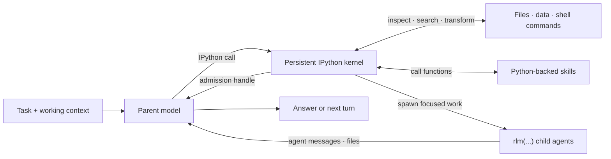

# RLM Programming Model

Prime Agent is built around a recursive language model (RLM) runtime: the model works inside a persistent Python control environment and composes capabilities as code. Provider calls, session persistence, child lifecycles, scheduling, and safety policy remain in the TypeScript host; IPython is the model-facing programming surface.

## RLM Loop



The parent keeps its own context focused while Python holds working state and child agents receive only the context needed for their subtasks.

## Core Invariants

### 1. Execution is programmatic

The default RLM runtime exposes one built-in model tool: `ipython`. Reading and editing files, running project commands, transforming results, invoking skills, and delegating work all begin from that persistent kernel instead of separate built-in tool calls.

Python state survives across tool calls and compaction. Variables, imports, functions, parsed results, and task handles remain available on later turns:

```python
from pathlib import Path

config_files = list(Path(".").rglob("*.toml"))
large_files = [path for path in config_files if path.stat().st_size > 10_000]
```

Run a project's normal commands through its own environment from an IPython cell:

```bash
%%bash
npm run check
```

Each `%%bash` cell is a temporary subshell, while Python state and `%cd` changes persist in the kernel. Prime Agent extensions may intentionally add custom tools, but the built-in RLM design does not require a separate model tool for every capability.

### 2. Subagents are native RLM calls

The callable `rlm` object is preloaded in the kernel. Spawn a child with a direct call:

```python
handle = await rlm(
    "Review the authentication flow for security issues",
    name="auth-reviewer",
    service_tier="default",
)
print(handle.rlm_child_id, handle.name, handle.session_dir, handle.model)
```

The call returns immediately after task admission with a child handle; it never waits for or returns the child's answer. The TypeScript host creates a normal child `AgentSession` with an independent context and session directory. The child inherits the parent model, service tier, provider configuration, skills, tools, retry policy, and resource loader unless the call requests another configured model or service tier. Valid service tiers are `auto`, `default`, `flex`, `scale`, `priority`, and `None`; `priority` is clamped to `default` for child models without fast-mode support. Explicit `service_tier` overrides must be listed in the `rlmAllowedServiceTiers` settings array; when that setting is unset, only the configured `defaultServiceTier` is allowed. Omitting `service_tier` preserves parent-tier inheritance.

Spawn independent children in separate calls and end the turn instead of awaiting completion:

```python
api_review = await rlm("Review the public API", name="api-reviewer")
test_review = await rlm("Review the test coverage", name="test-reviewer")
integration_audit = await rlm("Run the slow integration audit", name="integration-audit")
```

Results arrive only through explicit `agent_message` replies or files, never as an `rlm()` return value. Children reply when an answer is needed:

```python
await agent_message.send(message, receiver_role="parent")
```

The parent can follow up with a retained child:

```python
await agent_message.send(
    "Check the newly added regression test.",
    receiver_role="child",
    receiver_name=api_review.name,
)
```

#### Child handles and lifecycle

An admission handle contains `rlm_child_id`, `name`, `session_dir`, and `model`. Child usage is attributed to the parent session while remaining distinguishable in context-tree reporting.

The parent-scoped child registry survives compaction, kernel restart, and parent restoration:

```python
children = await rlm.list_subagents()
for child in children:
    print(child.session_name, child.status, child.active_session_id)
```

Successfully completed daemon-backed children remain addressable while their parent session is open. Delete a child only when its context is no longer needed:

```python
await rlm.delete_subagent(children[0])
```

The default recursion depth allows a root agent to create children. Raising the configured depth allows descendants to recurse further.

### 3. Act transfers one serial task into the root world

A root agent can synchronously transfer one bounded task to the associated `@luna` default or select another ordinary native model route:

```python
result = await rlm.act("Inspect the current state, implement the focused change, and return the live result.")
deep_result = await rlm.act("Solve the harder bounded task.", model="@deepseek")
```

`model` accepts the same named-role and concrete native selectors as ordinary RLM model selection. Use a `concrete_selector` returned by `await rlm.find_models(...)` when selecting a concrete model. Omission selects `@luna`. Invalid, unavailable, unauthenticated, and non-native selectors fail before provider or shared-cell work.

Act retains one private model session and gives it a serialized `shared_ipython` tool. Accepted model changes append to that session's one transcript rather than creating another lane. The cells run in the root session's existing IPython shell and namespace, so the active model sees prior variables and mutations directly. The private session has no family identity, child registry entry, or separate kernel. A persisted root restores the private transcript and the root kernel's completed namespace snapshot, so a later Act continues both contexts after restart. An Act interrupted by restart is closed once as an `interrupted` journal fact without replaying its provider request or shared cell.

The active model completes through a shared cell:

```python
rlm.done(value)
```

`done` stops that cell and returns the identical Python object to the suspended root call. The value is not serialized through the TypeScript host. Assign the result so IPython does not display an accidental representation. A normal text response without `done` is an `ActError`, and only one Act may be active in a root session.

Cancelling Act aborts provider work and awaited Python first. `rlm.ACT_CANCELLATION_CAPABILITY` reports the current kernel contract. `"posix-managed"` means that, if the same correlated inner cell remains active after a short grace period, Prime Agent interrupts that cell and terminates the supervised process group used by managed `%%bash`. `"cooperative-only"` is the native Windows contract: synchronous Python and blocking shell work may remain active until they return. WSL is POSIX and reports `"posix-managed"`.

The live namespace remains authoritative and later root cells reuse it. Native, detached, daemonized, remote, already-completed, and otherwise unmanaged work remains outside the prompt-stop guarantee on every platform. Cancellation does not roll back effects completed before the stop.

Act is a foreground transfer, not parallel delegation. The directing turn and its nested root cells share one foreground lease. Concurrent root prompts, root cells, compaction, and continuations wait in admission order until that lease is released; ordinary RLM children remain independent. Steering accepted before the Act terminal goes directly to the retained model's ordered conversation without waking Sol. A terminal-race loss rejects that targeted steering request. Use ordinary `rlm(...)` children when work should proceed independently, needs a separate kernel or family identity, or must be messaged and observed as a child.

Supported clients project Act beneath the correlated outer IPython cell. The live stream identifies the selected model, exact cancellation capability, bounded prompt and progress, shared cells, status, and usage. Interactive mode renders a nested collapsible component; JSON and RPC preserve the typed event; ACP maps one Act to one bounded synthetic tool call; and text print emits one terminal record on stderr. Older peers still receive the ordinary outer IPython event. No client projection receives the Python value passed to `rlm.done()`.

### 4. Skills add programmatic capability

Prime Agent supports the Agent Skills markdown format and extends it with Python-backed skills. Both use `SKILL.md` for discovery, routing, and instructions. A Python-backed skill also contains a Python package that Prime Agent installs into the kernel environment and exposes by import name.

For a skill named `release-audit`, the model can call:

```python
report = await release_audit(repository=".", target_version="0.4.0")
```

This makes Python-backed skills a superset of instruction-only skills: they can provide guidance, scripts, references, dependencies, typed callables, and optional shell commands. They may also call `rlm(...)` themselves when a capability needs recursive delegation.

Only skill metadata is placed in the startup prompt. The agent loads the full `SKILL.md` when the task matches, then inspects and calls the documented Python API. See [Skills](skills.md) for discovery, packaging, and the built-in skill-creation workflow.

### 5. State is designed to outlive one turn

The RLM programming model assumes useful work may take many turns or continue after the terminal UI closes:

- automatic compaction summarizes older context while preserving recent messages and kernel state;
- daemon-backed workers keep active sessions running after clients detach;
- child registries and session artifacts make subagents recoverable;
- heartbeats and scheduled prompts re-enter a session later;
- persistent goals continue until the objective is complete or the user changes their state; and
- autonomous mode adds bounded continuations and optional quality gates.

See [Long-Running and Background Agents](long-running-agents.md) for these lifecycle features.

## Host Bridge

Python skills use typed host requests for capabilities whose authoritative state belongs outside the kernel. For example, the `goal`, `agent_message`, `rlm_heartbeat`, and `compact` skills call `rlm.host_request(...)`; the TypeScript host validates the request and owns the state transition.

This keeps credentials, provider execution, transcript writes, worker routing, and scheduling out of Python while retaining a programmatic model interface.

## Trust Model

The IPython kernel runs model-generated Python and project commands with the worker's operating-system permissions. It is a durable control environment, not a security sandbox. Review third-party Python skills and use an external sandbox or restricted environment for untrusted repositories and instructions.

For implementation details, see [RLM Runtime Architecture](rlm-runtime.md).
