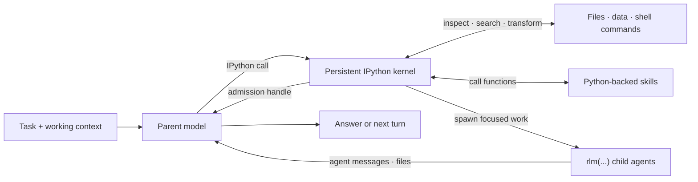

# RLM Programming Model

Prime Agent is built around a recursive language model (RLM) runtime: the model works inside a persistent Python control environment and composes capabilities as code. Provider calls, session persistence, child lifecycles, scheduling, and safety policy remain in the TypeScript host; IPython is the model-facing programming surface.

## RLM Loop



The parent keeps its own context focused while Python holds working state and child agents receive only the context needed for their subtasks.

## Core Invariants

### 1. Execution is programmatic

The default RLM runtime exposes one built-in model tool: `ipython`. Reading and editing files, running project commands, transforming results, invoking skills, and delegating work all begin from that persistent kernel instead of separate built-in tool calls.

Python state survives across tool calls and compaction. Variables, imports, functions, parsed results, and task handles remain available on later turns:

```python
from pathlib import Path

config_files = list(Path(".").rglob("*.toml"))
large_files = [path for path in config_files if path.stat().st_size > 10_000]
```

Run a project's normal commands through its own environment from an IPython cell:

```bash
%%bash
npm run check
```

Each `%%bash` cell is a temporary subshell, while Python state and `%cd` changes persist in the kernel. Prime Agent extensions may intentionally add custom tools, but the built-in RLM design does not require a separate model tool for every capability.

### 2. Subagents are native RLM calls

The callable `rlm` object is preloaded in the kernel. Spawn a child with a direct call:

```python
handle = await rlm(
    "Review the authentication flow for security issues",
    name="auth-reviewer",
    service_tier="default",
)
print(handle.rlm_child_id, handle.name, handle.session_dir, handle.model)
```

The call returns immediately after task admission with a child handle; it never waits for or returns the child's answer. The TypeScript host creates a normal child `AgentSession` with an independent context and session directory. The child inherits the parent model, service tier, provider configuration, skills, tools, retry policy, and resource loader unless the call requests another configured model or service tier. Valid service tiers are `auto`, `default`, `flex`, `scale`, `priority`, and `None`; `priority` is clamped to `default` for child models without fast-mode support. Explicit `service_tier` overrides must be listed in the `rlmAllowedServiceTiers` settings array; when that setting is unset, only the configured `defaultServiceTier` is allowed. Omitting `service_tier` preserves parent-tier inheritance.

Spawn independent children in separate calls and end the turn instead of awaiting completion:

```python
api_review = await rlm("Review the public API", name="api-reviewer")
test_review = await rlm("Review the test coverage", name="test-reviewer")
integration_audit = await rlm("Run the slow integration audit", name="integration-audit")
```

Results arrive only through explicit `agent_message` replies or files, never as an `rlm()` return value. Children reply when an answer is needed:

```python
await agent_message.send(message, receiver_role="parent")
```

The parent can follow up with a retained child:

```python
await agent_message.send(
    "Check the newly added regression test.",
    receiver_role="child",
    receiver_name=api_review.name,
)
```

#### Child handles and lifecycle

An admission handle contains `rlm_child_id`, `name`, `session_dir`, and `model`. Child usage is attributed to the parent session while remaining distinguishable in context-tree reporting.

The parent-scoped child registry survives compaction, kernel restart, and parent restoration:

```python
children = await rlm.list_subagents()
for child in children:
    print(child.session_name, child.status, child.active_session_id)
```

Successfully completed daemon-backed children remain addressable while their parent session is open. Delete a child only when its context is no longer needed:

```python
await rlm.delete_subagent(children[0])
```

The default recursion depth allows a root agent to create children. Raising the configured depth allows descendants to recurse further.

### 3. Act transfers one serial task into the root world

Use Act for one inspectable action expected to take roughly 30 seconds to 5 minutes, with shorter actions preferred. The directing model keeps architecture, synthesis, decomposition, and acceptance. It inspects decisive source, diff, or test evidence after each result before choosing another action.

Bad—this incorrectly hands Act an entire multi-phase plan:

```python
await rlm.act("Implement every phase of the migration, verify everything, and ship it")
```

Good—this assigns one inspectable step:

```python
result = await rlm.act("Inspect the parser owner, fix the delimiter advance, run parser.test.ts, and return the diff and raw test result")
```

Set up the retained lane once with its stable working directory, editing or verification authority, return contract, and expectation of a bounded sequence. Later prompts can be terse deltas because the lane keeps its transcript:

```python
await rlm.act("In /repo, you may edit parser files and run focused tests. Return the inspected diff and raw test result. First inspect the parser owner.")
await rlm.act("Now run the StarPC baseline")
await rlm.act("Now fix the failing delimiter case and rerun its focused test")
await rlm.act("Now verify only; do not edit. Work from /repo/wt/review and return raw test output")
```

A delta restates any changed or ambiguous directory, authority, safety, or result-shape constraint. The directing model inspects every returned result.

Use the live IPython namespace as the handoff between both models. The directing model can bind clients, datasets, parsed structures, helpers, and intermediate results to clear names before calling Act. Act reuses those objects and can leave useful state in named variables for the directing model to inspect or continue after return. This preserves exact Python identity and avoids describing or reconstructing live state in prompt text.

`model` accepts the same named-role and concrete native selectors as ordinary RLM model selection. Omission selects `rlmActDefaultModel`; without it callers pass `model` explicitly. Invalid or unavailable selectors fail before provider or shared-cell work.

Act retains one private model session and gives it a serialized `shared_ipython` tool. Accepted model changes append to that session's transcript. Cells run in the root IPython namespace. The private session has no family identity, registry entry, or separate kernel. Restart restores completed transcript and namespace state but never replays interrupted work.

The actor finishes with `rlm.done(value)` in a shared cell. The identical Python object returns to the suspended root call without TypeScript serialization. Assign the result to avoid accidental display. A normal text response without `done` is an `ActError`; only one Act may be active.

Act is a foreground transfer. Root prompts, cells, compaction, and continuations wait until its lease ends; ordinary RLM children remain independent. Text submitted during Act appears immediately in the normal queued-steering section, remains hidden from Act, and does not interrupt it. After natural completion or failure, queued messages enter the ordinary directing-model steering lifecycle in submission order. Escape explicitly interrupts the interactive Act. Ctrl-C retains the documented hard-cancellation contract: provider and cooperative awaited Python stop on every host, with correlated synchronous-cell and managed-process-group termination on POSIX. Completed effects are not rolled back.

Supported interactive clients frame Act with actor separators but feed its thinking, text, IPython, shell, and tool activity through the same parent transcript renderers. JSON, RPC, ACP, and print preserve their typed projections. Older peers retain the outer IPython fallback. No projection receives the value passed to `rlm.done()`.

### 4. Skills add programmatic capability

Prime Agent supports the Agent Skills markdown format and extends it with Python-backed skills. Both use `SKILL.md` for discovery, routing, and instructions. A Python-backed skill also contains a Python package that Prime Agent installs into the kernel environment and exposes by import name.

For a skill named `release-audit`, the model can call:

```python
report = await release_audit(repository=".", target_version="0.4.0")
```

This makes Python-backed skills a superset of instruction-only skills: they can provide guidance, scripts, references, dependencies, typed callables, and optional shell commands. They may also call `rlm(...)` themselves when a capability needs recursive delegation.

Only skill metadata is placed in the startup prompt. The agent loads the full `SKILL.md` when the task matches, then inspects and calls the documented Python API. See [Skills](skills.md) for discovery, packaging, and the built-in skill-creation workflow.

### 5. State is designed to outlive one turn

The RLM programming model assumes useful work may take many turns or continue after the terminal UI closes:

- automatic compaction summarizes older context while preserving recent messages and kernel state;
- daemon-backed workers keep active sessions running after clients detach;
- child registries and session artifacts make subagents recoverable;
- heartbeats and scheduled prompts re-enter a session later;
- persistent goals continue until the objective is complete or the user changes their state; and
- autonomous mode adds bounded continuations and optional quality gates.

See [Long-Running and Background Agents](long-running-agents.md) for these lifecycle features.

## Host Bridge

Python skills use typed host requests for capabilities whose authoritative state belongs outside the kernel. For example, the `goal`, `agent_message`, `rlm_heartbeat`, and `compact` skills call `rlm.host_request(...)`; the TypeScript host validates the request and owns the state transition.

This keeps credentials, provider execution, transcript writes, worker routing, and scheduling out of Python while retaining a programmatic model interface.

## Trust Model

The IPython kernel runs model-generated Python and project commands with the worker's operating-system permissions. It is a durable control environment, not a security sandbox. Review third-party Python skills and use an external sandbox or restricted environment for untrusted repositories and instructions.

For implementation details, see [RLM Runtime Architecture](rlm-runtime.md).
